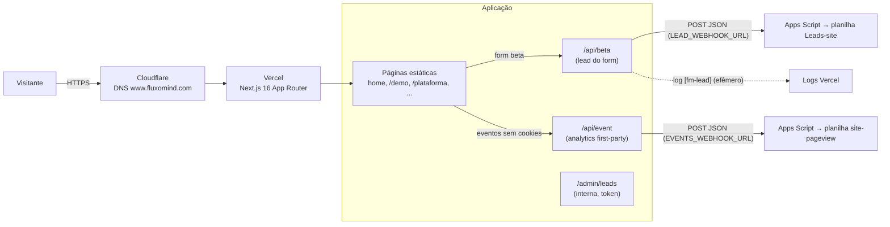

# Arquitetura do site

Visão de componentes do www.fluxomind.com. O *porquê* de cada escolha está nos
[ADRs](adr/README.md); a operação (deploy, incidentes) está em [runbooks.md](runbooks.md).

## Diagrama

## Componentes

| Componente | O que é | Onde |
|---|---|---|
| Páginas | Estáticas, geradas no build; SEO em `sitemap.ts`, `robots.ts`, JSON-LD no layout | `src/app/*/page.tsx` |
| Demo interativa | Jornada de criação (persona Ally), 3 cenários, roda 100% no cliente | `src/components/JourneyDemo.tsx`, `DemoBuilder.tsx` |
| Captura de leads | Valida, loga e repassa ao webhook; honeypot + rate-limit | `src/app/api/beta/` |
| Analytics | Eventos first-party sem cookies (taxonomia em [leads-analytics.md](leads-analytics.md)) | `src/app/api/event/`, `src/components/Analytics.tsx` |
| Admin de leads | Tabela interna noindex; exige `ADMIN_TOKEN`; depende de filesystem persistente (não funciona na Vercel) | `src/app/admin/leads/` |
| Páginas legais | Termos de Uso e Política de Privacidade (LGPD) | `src/app/terms/`, `src/app/privacidade/` |

## Fluxo dos dados de lead

1. Visitante envia o form do beta → `POST /api/beta`.
2. A rota valida (e-mail, honeypot, rate-limit 5/h por IP), grava no log
   (`[fm-lead]`, efêmero) e repassa ao `LEAD_WEBHOOK_URL`.
3. O Apps Script recebe e grava na planilha **Leads-site** — o destino durável
   oficial.
4. Se o webhook falhar: API responde 502 e o form oferece fallback por e-mail;
   o lead ficou no log como amortecedor.

## Infraestrutura externa

Projeto Vercel, envs de produção, planilhas e Search Console estão registrados em
[historico-implantacao.md](historico-implantacao.md) — valores de env **nunca**
entram no repo.
